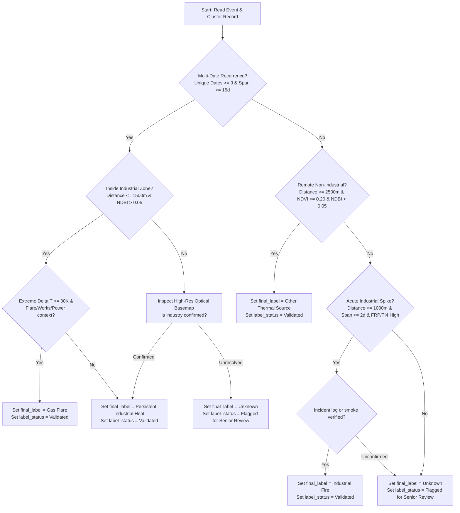

# Standard Operating Procedure: Human Labeling & Validation Instructions
**Project**: SIH26162 — AI-Based Detection and Classification of Industrial Fires & Persistent Thermal Sources  
**Dataset Target**: [`data/reports/HUMAN_LABELING_SHEET.csv`](file:///c:/Users/sampa/OneDrive/Desktop/SIH%2026/data/reports/HUMAN_LABELING_SHEET.csv)  
**Document Type**: Standard Operating Procedure (SOP) & Audit-Ready Manual  
**Date**: September 9, 2026  
**Audience**: Human Annotators, RS/GIS Specialists, and AI/ML Data Quality Leads  

---

## 1. Overview & Objective

This document establishes the standardized, audit-ready procedure for reviewing, validating, and annotating all **202 thermal anomaly events** in [`HUMAN_LABELING_SHEET.csv`](file:///c:/Users/sampa/OneDrive/Desktop/SIH%2026/data/reports/HUMAN_LABELING_SHEET.csv).

All 202 records in the labeling sheet are currently initialized to:
- `final_label` = **`Unknown`**
- `label_status` = **`Needs Human Validation`**

> [!IMPORTANT]
> **Strict Controlled Vocabularies**:
> - **`final_label`** MUST be exactly one of:
>   1. `Industrial Fire`
>   2. `Gas Flare`
>   3. `Persistent Industrial Heat`
>   4. `Other Thermal Source`
>   5. `Unknown` *(assigned when empirical evidence remains insufficient or unresolvable)*
> - **`label_status`** MUST be exactly one of:
>   1. `Needs Human Validation` *(initial state awaiting review)*
>   2. `Validated` *(evidence conclusively verified and signed off by annotator)*
>   3. `Flagged for Senior Review` *(borderline, high ambiguity, or conflicting multi-sensor signals)*

---

## 2. Standard Target Class Definitions

```
+-----------------------------------------------------------------------------------------------+
|                                      TARGET CLASS TAXONOMY                                    |
+---+----------------------------+--------------------------------------------------------------+
| # | Class Name                 | Standard Technical Scope & Definition                        |
+---+----------------------------+--------------------------------------------------------------+
| 1 | Industrial Fire            | Acute, uncontrolled accidental combustion incident occurring |
|   |                            | within or immediately adjacent to industrial infrastructure. |
+---+----------------------------+--------------------------------------------------------------+
| 2 | Gas Flare                  | High-temperature point-source combustion stack at refinery,  |
|   |                            | chemical, petrochemical, gas-processing, or generator works. |
+---+----------------------------+--------------------------------------------------------------+
| 3 | Persistent Industrial Heat | Chronic, operational furnace/kiln/boiler thermal emissions   |
|   |                            | recurring systematically over multiple weeks or months.      |
+---+----------------------------+--------------------------------------------------------------+
| 4 | Other Thermal Source       | Non-industrial thermal anomaly (agricultural crop residue    |
|   |                            | burning, open biomass, rural fire, landfill, or artifact).   |
+---+----------------------------+--------------------------------------------------------------+
```

---

## 3. Standardized Annotation Decision Workflow

Annotators must process each event through the following standardized decision hierarchy:



---

## 4. Evidence-Based Validation Rules (Class-by-Class)

### Class 1: `Industrial Fire`
- **Spatial Proximity**: $\text{nearest\_industry\_distance\_m} \le 1000\text{ m}$ (preferably $< 500\text{ m}$) or $\text{industries\_within\_1km} \ge 1$.
- **Surface Reflectance**: Built-up impervious footprint ($\text{NDBI} > 0.00$, $\text{NDVI} < 0.30$).
- **Temporal Ephemerality**: **Strictly transient** ($1$ to $2$ consecutive satellite passes; cluster span $\le 2$ days).
- **Thermal Magnitude**: Elevated Fire Radiative Power ($\text{FRP} \ge 3.0\text{ MW}$ to $> 20\text{ MW}$) and high brightness temperature ($\text{bright\_ti4} > 335\text{ K}$).
- **Validation Requirement**: Cross-reference with municipal fire department records, local news reports, or optical smoke plume evidence.

### Class 2: `Gas Flare`
- **Thermal Contrast**: High sub-pixel spectral difference ($\Delta T = \text{bright\_ti4} - \text{bright\_ti5} \ge 25.0 - 45.0\text{ K}$).
- **Night-Time Detectability**: Readily observed in night passes ($\text{daynight} = 0$).
- **Spatial Context**: Co-located at petrochemical, refinery, chemical works, generator plants, or heavy manufacturing sites (`nearest_man_made = works` / `nearest_power = generator` / *Reliance resin industries*).
- **Spatial Stability**: Exact point-source coordinate stability over time.

### Class 3: `Persistent Industrial Heat`
- **Temporal Persistence**: High recurrence across multiple dates over weeks/months ($\text{cluster\_unique\_dates} \ge 3$, $\text{cluster\_span\_days} \ge 15 - 80\text{ days}$).
- **Spatial Clustering**: Located directly inside dense industrial parks ($\text{nearest\_industry\_distance\_m} \le 1000\text{ m}$, $\text{industries\_within\_500m} \ge 1$).
- **Surface Profile**: High built-up index ($\text{NDBI} \ge +0.05$ to $+0.30$), low vegetation ($\text{NDVI} < 0.25$), and negative water index ($\text{NDWI} < -0.20$).
- **Archetype**: See `Cluster_004` (25 events across 21 dates spanning 81 days at 388m).

### Class 4: `Other Thermal Source`
- **Remote Location**: Far from mapped industrial facilities ($\text{nearest\_industry\_distance\_m} > 2500\text{ m}$, $\text{industries\_within\_1km} = 0$).
- **Agricultural / Rural Profile**: High vegetation index ($\text{NDVI} > 0.25 - 0.87$) and low/negative built-up index ($\text{NDBI} < 0.05$).
- **Temporal Ephemerality**: Isolated single-day burn ($\text{cluster\_unique\_dates} = 1$).
- **Daytime Overpass**: Characteristic of agricultural stubble burning or rural clearing.

---

## 5. Protocols for Handling Ambiguous Records & Insufficient Evidence

When multi-sensor tabular evidence is conflicting or incomplete:

1. **Do NOT Guess or Force a Label**:
   - If an event cannot be proven beyond reasonable doubt using satellite and spatial evidence, do not assign a speculative class.
2. **Standard Resolution Protocol**:
   - Inspect optical base imagery (Sentinel-2 L2A true color or Google Earth historical high-res imagery).
   - If high-resolution imagery confirms an unmapped industrial plant, annotate accordingly.
   - If imagery remains ambiguous, set:
     - `final_label` = **`Unknown`**
     - `label_status` = **`Flagged for Senior Review`**
3. **Audit Trail Documentation**:
   - In `annotator_id`, enter your identifier (e.g., `SAMPAD_ROY`).
   - In `annotator_notes`, document the specific finding and rationale (e.g., *"Confirmed agricultural field on Sentinel-2 2026-04-12"* or *"Borderline distance 1850m with no visible industrial structures; flagged for senior review"*).

---

## 6. Field Dictionary for `HUMAN_LABELING_SHEET.csv`

| Field Name | Access Mode | Description / Allowed Controlled Values |
| :--- | :--- | :--- |
| `event_id` | Read-only | `FIRMS_0001` to `FIRMS_0202` |
| `cluster_id` | Read-only | Spatial cluster identifier (`0` to `135`) |
| `acq_date` | Read-only | Acquisition date (`YYYY-MM-DD`) |
| `acq_time` | Read-only | Acquisition time (`HH:MM` UTC) |
| `satellite` | Read-only | Sensor platform (`N20`) |
| `instrument` | Read-only | Sensor instrument (`VIIRS`) |
| `latitude`, `longitude` | Read-only | Decimal spatial coordinates |
| `daynight` | Read-only | `1` (Day) or `0` (Night) |
| `bright_ti4`, `bright_ti5` | Read-only | VIIRS I4 / I5 brightness temperatures (K) |
| `delta_ti4_ti5` | Read-only | $\Delta T = \text{ti4} - \text{ti5}$ (K) |
| `frp` | Read-only | Fire Radiative Power (MW) |
| `confidence` | Read-only | Quality flag (`l`, `n`, `h`) |
| `nearest_industry_distance_m` | Read-only | Distance to nearest OSM industrial polygon (m) |
| `industries_within_500m`, `1km`, `2km` | Read-only | Radial facility density counts |
| `NDVI`, `NDBI`, `NDWI` | Read-only | Sentinel-2 spectral indices |
| `cluster_event_count` | Read-only | Total events in 500m cluster |
| `cluster_unique_dates` | Read-only | Distinct observation dates in cluster |
| `cluster_span_days` | Read-only | Cluster temporal span in days |
| `candidate_class` | Read-only | Preliminary empirical suggestion |
| `candidate_evidence_summary` | Read-only | Multi-sensor supporting evidence |
| `evidence_confidence` | Read-only | `High` / `Medium` / `Low` / `Ambiguous` |
| `validation_action_required` | Read-only | Suggested verification action |
| **`annotator_id`** | **Mandatory Editable** | Identifier of the reviewer (e.g., `SAMPAD_R`) |
| **`annotator_notes`** | **Mandatory Editable** | Scientific justification and evidence cited |
| **`final_label`** | **Mandatory Editable** | **Strictly one of:**<br>• `Industrial Fire`<br>• `Gas Flare`<br>• `Persistent Industrial Heat`<br>• `Other Thermal Source`<br>• `Unknown` |
| **`label_status`** | **Mandatory Editable** | **Strictly one of:**<br>• `Needs Human Validation`<br>• `Validated`<br>• `Flagged for Senior Review` |

---

## 7. Quality Assurance & Audit Compliance Checklist

Before submitting an annotated sheet for ML model dataset construction:

- [ ] Every single row has a non-empty `annotator_id`.
- [ ] Every modified row has detailed documentation in `annotator_notes`.
- [ ] `final_label` contains **only** allowed vocabulary values (`Industrial Fire`, `Gas Flare`, `Persistent Industrial Heat`, `Other Thermal Source`, `Unknown`).
- [ ] `label_status` contains **only** allowed vocabulary values (`Needs Human Validation`, `Validated`, `Flagged for Senior Review`).
- [ ] All rows with `final_label = Unknown` have `label_status = Flagged for Senior Review` or `Needs Human Validation`.
- [ ] No changes were made to the original `AI_MODEL_INPUT.csv` or feature values.
